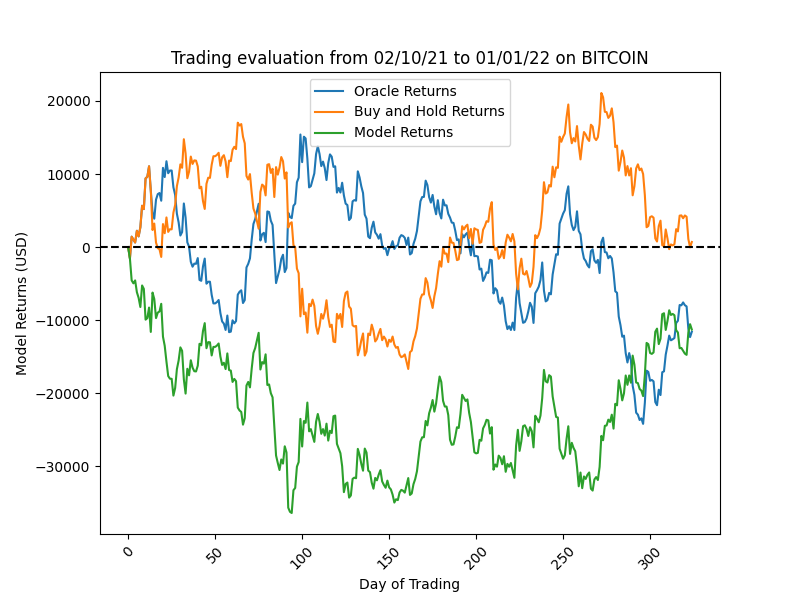

# Finding the Optimal Cyptocurrency Trading Strategy using Deep Learning

## Description

We are training a deep learning model to find the optimal trading strategy on the BTC dataset, which can be found at [^yahoo-finance]. An important assumption that we are making is that there are **no fees**.



## How to run

### Conda

Make sure that you have Anaconda or Miniconda installed, or something similar.

`$ git clone https://github.com/TorNATO-PRO/crypto-forecasting.git`

`$ cd crypto-forecasting`

`$ conda env create -f environment.yml`

`$ conda activate crypto`

`(crypto) $ python main.py`

### Docker

Ensure that Docker is installed.

`$ git clone https://github.com/TorNATO-PRO/crypto-forecasting.git`

`$ cd crypto-forecasting`

`$ docker build -it .`

`$ docker run crypto`

------

## TODO

- [x] Create basic directory structure
- [X] Implement Baseline
- [X] Implement Oracle
- [X] Added NNI for hyperparameter tuning
- [X] Create custom model(s) for data
- [X] Develop loss function(s) for comparing performance
- [ ] Figure out a way to measure power consumption and execution time
- [ ] Train on all datasets
- [ ] Train on more datasets

## Project Structure

```
.
├── LICENSE
├── README.md
├── assets
│   └── datasets
│       ├── BTC-USD.csv
│       └── ETH-USD.csv
├── environment.yml
├── main.py
├── requirements.txt
└── src
    ├── __init__.py
    ├── data_loader
    │   ├── __init__.py
    │   └── load.py
    ├── models
    │   ├── __init__.py
    │   ├── baseline
    │   │   └── baseline.py
    │   ├── custom
    │   │   └── custom.py
    │   ├── loss.py
    │   ├── oracle
    │   │   ├── data
    │   │   │   └── oracle_best.pth
    │   │   └── oracle.py
    │   └── utils.py
    └── tuning
        ├── __init__.py
        ├── custom_hyp_conf.yml
        ├── custom_trial.py
        ├── oracle_hyp_conf.yml
        ├── oracle_trial.py
        ├── search_space_custom.json
        └── search_space_oracle.json
```

[^yahoo-finance]: https://finance.yahoo.com/quote/BTC-USD/history/
